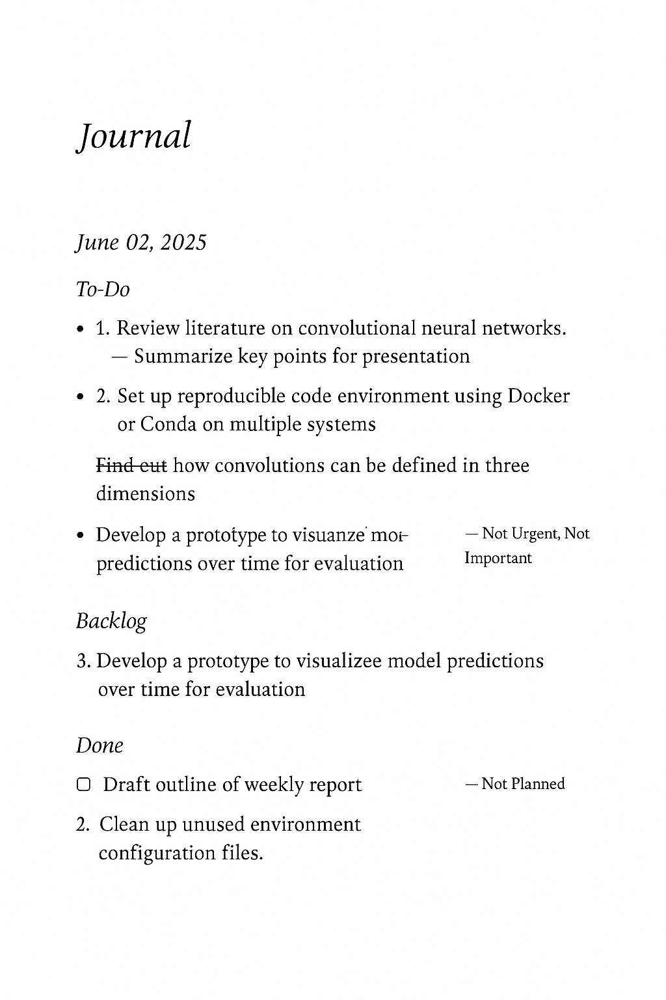
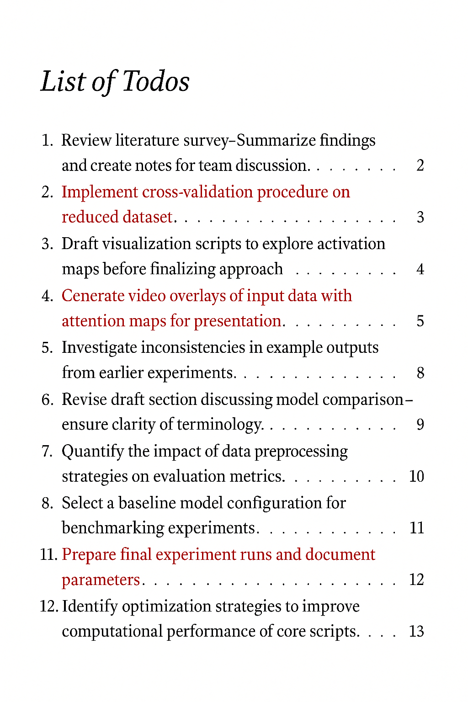

# Work Journal
A system for both journaling your daily work related activities along with a task management system entirely in LaTeX.

## Idea
A task management system based on task lists - todo, done, etc. might not cut it for everyone.
Often, it is desirable to -
1. Have a daily plan of what tasks you want to get accomplished in a day.
2. To keep a record later of what tasks you actually got to do in the day.
3. To know which other unplanned tasks you had to do during the day.
4. Keep notes on any of these tasks.

These are often the details that one requires during a typical stand-up meeting.
While full blown solutions like Trello and the like exist for doing such things,
sometimes a simple LaTeX based solution might be all that is needed.

## Features Implemented
- Use the `tufte-book` template for journaling aesthetics and margin notes.
- Mark text as a task using the `todo` macro.
- Tasks have continously incrementing internal numbering.
- Mark a task as done.
- List of Todos (or List of Done Todos) with backlinks to where they originally appear in the text.
- Colors tasks differently when displayed in the list of todos.
- Pass `strike` to strikeout tasks from the journal but not from the list of done todos for readability.

## To be Implemented
- Serial numbering in the list of todos to see number of pending tasks.
- Track when a todo is done - if not completed on the day it was added.

## Screenshots

(Note: I used AI to generate a fake version from my actual journal so never mind the typos.)

## Usage Tips

- Define aliases using `\newcommand` for coloring different kinds of tasks as they appear in the list of todos - for e.g. tasks that belong in the backlog can be colored green and those that you want to focus on for the day can be colored red etc.
- Reserve the `strike` option for tasks that were added and completed on a single day so they would appear in the ToDo section but would appear crossed out in the text.
- Define aliases for frequently used `marginnote` comments.
